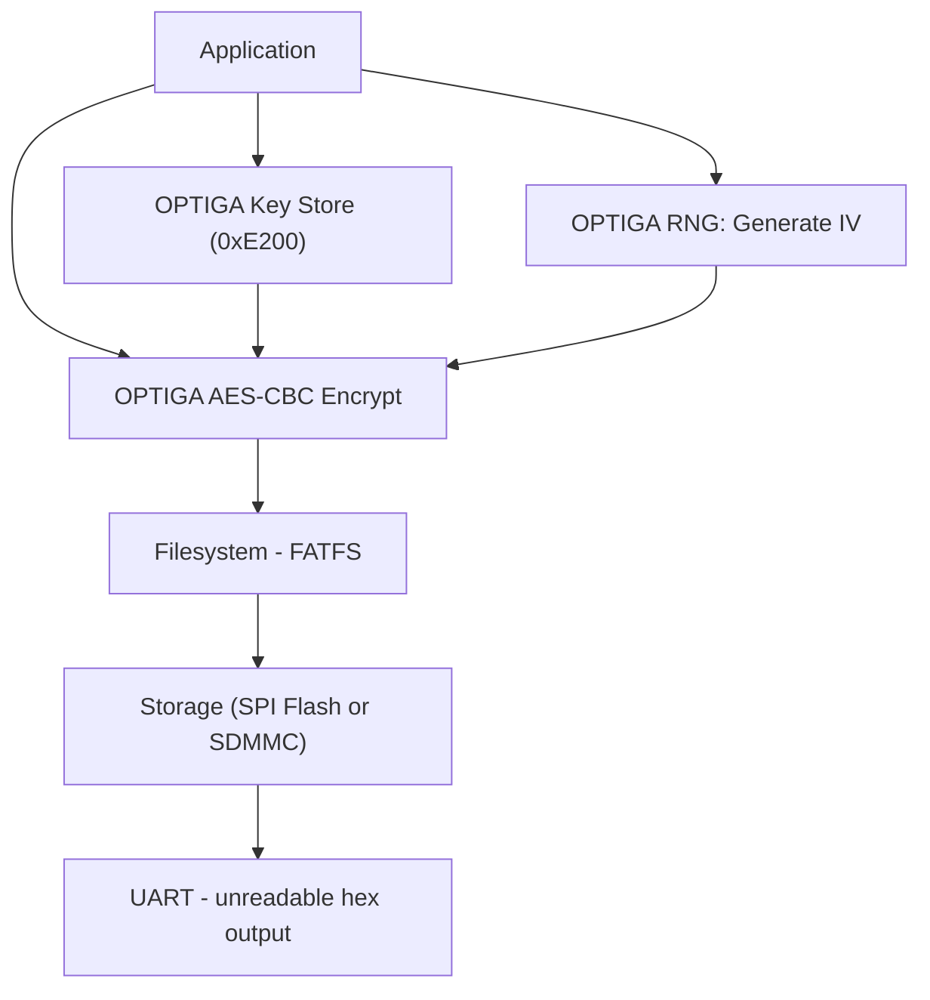

# Part 2: Encrypted Data Logging (Key in OPTIGA)
This tutorial shows how to **encrypt log data before writing it to storage** using
AES-CBC performed inside OPTIGA Trust M. The AES key never leaves OPTIGA.

> Part 2 of 3 | [Back to Tutorial Hub](https://github.com/nitikorn20/optiga-secure-data-logging-tutorials)

[]()

---

## Goal
Demonstrate that:
- Log data is **encrypted before storage** using OPTIGA AES-CBC
- AES key is generated and stored in **OPTIGA key slot (0xE200)**
- Key never appears in MCU RAM or NVS
- Part 3 can decrypt using the same OPTIGA-stored key

---

## Key Message
The key lives inside OPTIGA. The MCU only supplies plaintext and gets ciphertext.

---

## What You Will Build
- A log writer that encrypts data inside OPTIGA (AES-CBC)
- A binary log file (`enc_log.bin`) stored on flash
- A UART readback that prints **hex** (unreadable content)

---

## Process Overview



Steps:
1. Read metadata for OPTIGA key slot 0xE200
2. If key is not ready: write metadata + generate AES-128 key in OPTIGA
3. Generate random IV using OPTIGA TRNG (per record)
4. Encrypt plaintext with OPTIGA AES-CBC
5. Store `IV + ciphertext` in `enc_log.bin` (FATFS)

---

## Implementation Notes (ESP32)
- File name: `enc_log.bin`
- Record format: `IV (16B) || Ciphertext (64B)` = **80 bytes per record**
- Encryption: AES-128-CBC inside OPTIGA
- Key location: OPTIGA key store (OID `0xE200`)
- IV source: OPTIGA TRNG (each record)
- Output is **hex**, not plaintext
- This demo intentionally **does not decrypt** (see Part 3)

### Automatic Key Check
The app checks if the OPTIGA key slot (0xE200) is ready. If not, it writes metadata
and generates the AES-128 key automatically.

Optional override in `main/main.c`:
- `GENERATE_KEY_ON_BOOT = 1` -> force regenerate key (overwrites slot)
- `GENERATE_KEY_ON_BOOT = 0` -> auto-detect and only generate if missing (default)

---

## ESP32 (ESP-IDF) Quick Start
This repository includes a ready-to-build ESP-IDF version for WROOM-32.

**Project path:** repository root

### Build and Flash
```
idf.py set-target esp32
idf.py build flash monitor
```

### How to Use (ESP-IDF)
Use the UART monitor and type commands:
- `a` to append an encrypted record
- `c` to clear the log file
- `p` to print raw file content (hex)

The log file is stored internally at:
`/spiflash/enc_log.bin`

### SD Card Quick Checklist (SDMMC)
- **Pins (1-bit mode):** CLK=GPIO14, CMD=GPIO15, D0=GPIO2
- **Pull-ups:** 10k on CMD and D0
- **Bus width:** `LOG_SDMMC_BUS_WIDTH = 1`
- **Format:** FAT32
- **Switch:** `LOG_STORAGE_SDMMC = 1`

### Storage Switch (Compile-Time)
- `LOG_STORAGE_SDMMC = 0` uses internal SPI flash (default)
- `LOG_STORAGE_SDMMC = 1` uses SD card (SDMMC)

See `main/main.c` for details.

---

## Expected Output (Example)

### Subsequent Boots (key already ready)
```text
I (915) ENC_LOG: OPTIGA key metadata length: 17
I (915) ENC_LOG: Using existing OPTIGA key (OID 0xE200)
I (915) ENC_LOG: raw file content (hex):
I (915) ENC_LOG: 2e 1a 70 69 6c d7 53 02 53 19 fa 3b bd 6e 4a 15
I (925) ENC_LOG: 86 07 e5 28 5d e0 7d 4b ea 63 60 83 1f b9 80 ed
...
```

### After pressing 'a' and 'p'
```text
I (58005) ENC_LOG: encrypted: {"seq":1,"uptime_ms":57196}
I (60145) ENC_LOG: encrypted: {"seq":2,"uptime_ms":59521}
I (61265) ENC_LOG: encrypted: {"seq":3,"uptime_ms":60631}
I (62965) ENC_LOG: raw file content (hex):
I (62965) ENC_LOG: 2e 1a 70 69 6c d7 53 02 53 19 fa 3b bd 6e 4a 15
I (62965) ENC_LOG: 86 07 e5 28 5d e0 7d 4b ea 63 60 83 1f b9 80 ed
...
```

---

## Learning Checkpoints
- Understand "encrypt before storage"
- Confirm the key never leaves OPTIGA
- See how OPTIGA TRNG provides per-record IV

---

## Next
Proceed to Part 3 to **read and decrypt** the same file:
[03-optiga-data-logging-authorized-read](https://github.com/nitikorn20/03-optiga-data-logging-authorized-read)


